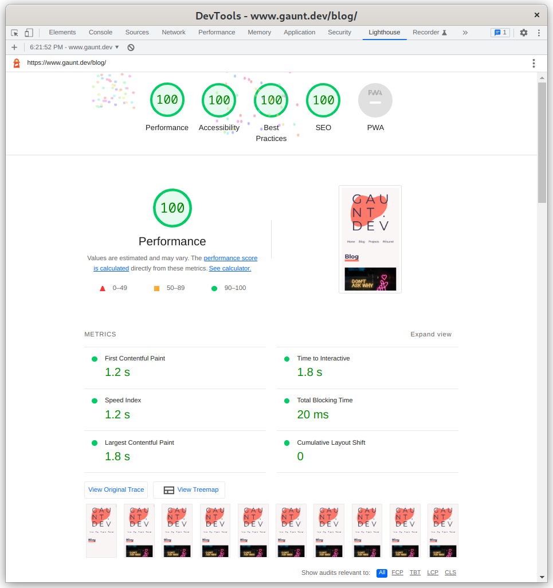

HTML asset manager provides a simple way to optimize CSS & JavaScripts assets in your statically generated site. You can think of it as an extra step in your build process.

## What does it do?
The asset manager does the following:

Looks through all of your site's files for HTML, CSS, JS, and image files
The CSS and JS files are categorized into asset groups (group assignment is done via name convention discussed below):
Inline
Synchronous
Asynchronous
Preload
For each HTML file, the asset manager runs a set of "manipulators" listed below:
Removes any existing CSS and JS on the page
Async Src
Default Size for iframes
Add sizes to images
Generates picture element markup
Injects the required CSS and JS based on the HTML and classes used in the page
Add `lazyload` to images
Updates image for Open Graph to a suitable size
Wraps images and iframes with divs to apply appropriate ratios to the elements
Swaps out YouTube and Vimeo iframes with a static image

## Why do all of this?
Using go-html-asset-manager will improve the overall performance of a site without requiring a specific build process or site generator.



## Installation
You will need to install golang to use this tool. Learn more at [go.dev](https://go.dev/doc/install).

Once go is installed, you can install the `htmlassets` tool with:

```bash
go install github.com/gauntface/go-html-asset-manager/v2/cmds/htmlassets@latest
```

If you'd like to generate image sizes, you can install the `genimgs` tool with:

```bash
go install github.com/gauntface/go-html-asset-manager/v2/cmds/genimgs@latest
```

## Usage
To use this tool, create an `asset-manager.json` file at the root of your project. This file will be used by both `htmlassets` and `genimgs`.

```
{
    "html-dir": "public/",
    "base-url": "https://www.gaunt.dev",
    "assets": {
      "static-dir": "public/",
      "json-dir": "data/"
    },
    "gen-assets": {
      "static-dir": "static/",
      "output-dir": "static/generated/",
      "output-bucket": "www.gaunt.dev",
      "output-bucket-dir": "generated/",
      "max-width": 700,
      "max-density": 3
    },
    "img-to-picture": [
      {
        "id": "c-project-item__img",
        "max-width": 620,
        "source-sizes": [
          "(min-width: 700px) 400px",
          "100vw"
        ]
      }
    ]
  }
```

With this file, the next step is to name your CSS and JS files in the following structure:

```
<HTML Element | CSS Classname>[-<inline | sync | async | preload>][.<media>].<css | js>
```
For example, your styles for `<h1>` elements might be:

`h1.css`: Primary CSS that you want to be inlined (**If no loading strategy is defined, inline is the default**)
`h1-async.css`: For optional styles.
`h1-sync.print.css`: Styles that are needed for print can be synchronously loaded by the browser when required.
`h1-async.js`: To load a script that adds anchor tags to the page.

If it's still unclear what is happening .

### Config

###### html-dir

This field is required and needs to be the path of the final HTML files. These files will be altered by `htmlassets`.

##### base-url

If you want to use `genimgs` to create a suitable image for social media posts, the base URL is needed to define a full URL to the generated image.

##### assets

`assets` tells `htmlassets` the various locations to look for images, CSS and JS.

##### assets > static-dir

`static-dir` is the path of CSS, JS and images served when deployed via "/".

For example, if the `static-dir` was `public/static/` and there was a JS file `public/static/script/example.js`, then `htmlassets` would assume this file could be referenced as `/script/example.js`.

##### assets > json-dir

You can define JSON files to describe assets you don't serve locally but should be injected into your HTML. A typical example is web fonts.

For example, `data/code.json` may define:

```json
{
    "css": {
        "preload": [
            "https://fonts.googleapis.com/css2?family=Fira+Code&display=swap"
        ]
    }
}
```

##### img-to-picture

If you want to convert `` elements to `<picture>`, you can provide an array of queries with information on the appropriate sizes to apply.

```
"img-to-picture": [
      {
        "id": "c-project-item__img",
        "max-width": 620,
        "source-sizes": [
          "(min-width: 700px) 400px",
          "100vw"
        ]
      },
      {
        "id": "c-blog-item__img",
        "max-width": 620,
        "source-sizes": [
          "(min-width: 620px) 200px",
          "100vw"
        ]
      },
      ....
]
```

##### gen-assets

This config is used by `genimgs` to manage generated images stored locally and on AWS s3.

##### gen-assets > static-dir

The local path to find images used in your site.

##### gen-assets > output-dir

The local path to place any images generated. If you are using S3 to store your image files, you can add this directory to your `.gitignore` file as `genimgs` will check S3 for missing images.

##### gen-assets > output-bucket

The name of the S3 bucket to store these files.

##### gen-assets > output-bucket-dir

The directory in the bucket to store the generated files

##### gen-assets > max-width

The maximum width you would like your images to be. This value will be multiplied by the `max-density` to get the max-width for all desired screen densities.

##### gen-assets > max-density

The maximum screen density you'd like to account for when generating images.

## Future Work

There are some features/changes I'd like to make.

Split the config out for `genimgs` so there is a clear separation.
Ability to add styles if one or more elements/classnames are in the page. I.e. if you wanted to add styles for h1-h6, this approach requires 6 files, vs just one file with styles defined as `h1,h2,h3,h4,h5,h6 {...}`.

Thank you to [Ashley McNamara for the gopher image](https://github.com/ashleymcnamara/gophers).